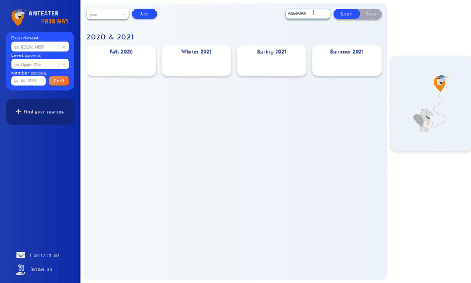

    

<h1 align="center">Anteater Pathway</h1>

    <a href="https://anteaterpathway.com">
        www.anteaterpathway.com
    </a>

Drag & Drop UCI Degree Planner

    

### What is Anteater Pathway?

Anteater Pathway helps UCI students create and manage their degree plans. Students can search for courses to enroll, view course information, and save them to their planners.

### Update - April 2023

-  Dark theme available
-  New course search window
-  Update-to-date course offer history

### The first look

    

### License

MIT License

See [LICENSE](/LICENSE) for the full text.
