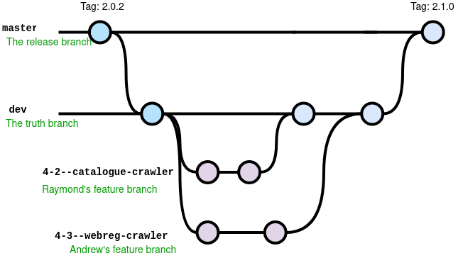

# Git Workflow




1. Clone the repo

    ``` Bash
    $ git clone https://github.com/anthopark/Anteater-Pathway.git
    ```

2. Check what git branches are available
   
    ``` Bash
    $ cd Anteater-Pathway
    $ git branch -a
    ```

3. Check out branch to `dev`.
   
    ``` Bash
    $ git checkout dev
    ```

4. Create a new branch off of `dev` branch.

    ``` Bash
    $ git checkout -b 4-2--catalogue-crawler
    ```

5. Commit changes and push to the remote Github repository.
    ``` Bash
    $ git add <some files to stage>
    $ git commit -m "some git message"
    
    # need --set-upstream when pushing the branch for the first time.
    $ git push --set-upstream origin 4-2--catalogue-crawler 
    ```

6. Go to the Anteater Pathway Github and create pull request. In the pull request, make sure to merge current branch to `dev` branch.