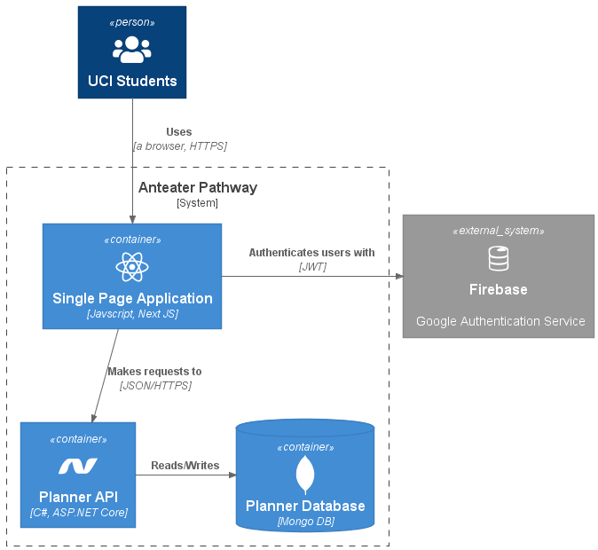
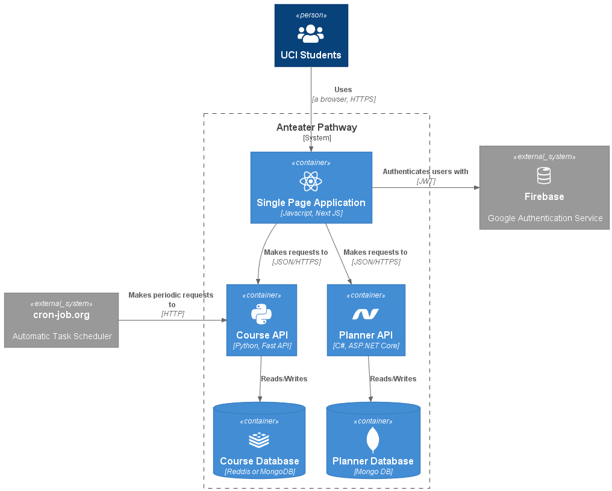

## Goals for Spring 2022

- Improve UX on the frontend application [Figma, React JS]
  - the course search bar
  - new display panel for course detailed info
- Build a new web API service for course data [Python, Docker]
  - periodic scrape [the UCI catalogue website](https://catalogue.uci.edu/allcourses/) for updating course data
  - periodic scrape [Web Reg](https://www.reg.uci.edu/perl/WebSoc) for updating course offering history
  - Separation of concerns between the existing Planner API and the new web API
  - API endpoints to serve the frontend application
    - course search
    - course detailed info

### Current Features

- Sign-in/out with Google Firebase Authentication
- Search for course items to add to the planner
- Auto planner data load upon sign-in
- Auto planner data save upon planner changes (e.g., add/remove course items, change course item colors)
- View course detailed information
- Color code course items

### Current Issues

- [UX/Frontend] Inconvenient course search bar
  - Search only available through exactly matched course code (INF 117)
  - Too many clicks involved for searching & adding workflow
- [UX/Frontend] Too many clicks involved for viewing course detailed info
  - Course detailed info can be displayed in a pane under the tentative planner
- [Backend] Course data scrapped from [the UCI catalogue website](https://catalogue.uci.edu/allcourses/) will get outdated
  - Need a web service that periodically scrap and update the course data from the website

### Current System High Level Architecture

#### Single Page Application

The [Next JS](https://nextjs.org/) frontend single page application. UCI students interact with this UI layer to use the service.

#### Planner API

The [ASP.NET core](https://docs.microsoft.com/en-us/aspnet/core/introduction-to-aspnet-core?view=aspnetcore-6.0) web API application for serving the frontend. This middle layer API application sits between the UI layer and the backend database, and provides the frontend application with the endpoints to which it can make HTTP requests.

API endpoints:

- user sign-in/out
- contact us
- search course item
- course detailed info
- planner data load/save

#### Planner Database

The MongoDB backend database for Planner API. It stores user data and course data.

NoSQL documents:

- users
- courses
- planners

#### Firebase

The external system for authentication with Google sign-in.

- Json Web Token (JWT) is returned to the frontend upon sign-in.
- JWT is used with HTTP requests to Planner API by the frontend.
- Firebase provides private keys which can be used by Planner API. Planner API authenticate HTTP requests from frontend and authorize its access to the API endpoints.

### Desired System High Level Architecture

#### Course API

The new Web API application dedicated for serving requests that are related to course data. Fast API, a Python web API framework, is going to be used. A Python web framework is chosen because BeautifulSoup, a very nice web scraping library, is available in the Python ecosystem.

API endpoints:

- scrape course data from the UCI catalogue website [the UCI catalogue website](https://catalogue.uci.edu/allcourses/)
- scrape course offering history data from [Web Reg](https://www.reg.uci.edu/perl/WebSoc)
- search course item
- course detailed info

#### Course Database

Redis or MongoDB NoSQL backend database for storing course data that were scraped.

NoSQL documents:

- courses